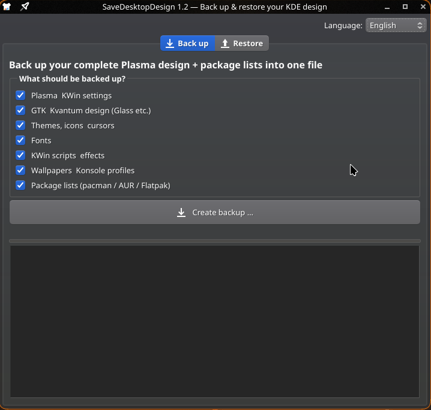

# SaveDesktopDesign

Backs up your **entire KDE Plasma design from A to Z into a single file** — and restores it on a new machine with one click.

Works on **Arch-based systems (CachyOS, EndeavourOS …), Ubuntu/Debian and Fedora** — anywhere KDE Plasma runs.

🌍 **Languages:** English · Deutsch · Français · Italiano · Español · Português · Türkçe — auto-detects your system language, switchable in the app.



## What gets backed up?

| Category | Contents |
|---|---|
| Plasma & KWin | Global themes, panel layouts, shortcuts, window rules, Krohnkite/script settings |
| GTK & Kvantum | Glass/Kvantum themes, GTK 2/3/4 configuration |
| Themes & icons | Desktop themes, look-and-feel, window decorations (Aurorae), color schemes, icons, cursors |
| Fonts | Custom fonts incl. fontconfig |
| KWin scripts & effects | Krohnkite & co. from `~/.local/share/kwin` |
| Wallpapers & more | Wallpapers, Konsole profiles |
| Package lists | pacman (explicit) & AUR, apt (manual), dnf (user-installed), Flatpak — e.g. for Rounded Corners, Force Blur, Kvantum |

> **Note:** Compiled KWin plugins (e.g. Rounded Corners) live in system directories and are reinstalled via the **package list**, not copied as files.
> Package restore works between machines of the **same distro family** (Arch→Arch, Ubuntu→Ubuntu, Fedora→Fedora); the design files themselves restore on any distro.

## Installation

**Arch / CachyOS / EndeavourOS:**
```bash
sudo pacman -S --needed git python python-pyqt6
```

**Ubuntu / Debian:**
```bash
sudo apt install git python3 python3-pyqt6
```

**Fedora:**
```bash
sudo dnf install git python3 python3-pyqt6
```

Then:
```bash
git clone https://github.com/redsoul1905/Savedesktopdesign.git
cd Savedesktopdesign
./install.sh
```

You'll then find **SaveDesktopDesign** in your application menu.

Run directly without installing:

```bash
python3 savedesktopdesign.py
```

## Usage

**Back up (old machine):**
1. Launch the app → **Back up** tab
2. Select categories (default: everything) → **Create backup**
3. Copy the resulting `.tar.gz` to a USB drive / cloud storage

**Restore (new machine):**
1. Launch the app → **Restore** tab → choose the archive
2. Click **Install packages** (opens a terminal; automatically uses `pacman`/`paru`/`yay`, `apt`, `dnf` or `flatpak` depending on your system)
3. **Log out and back in** so KWin effects and the design fully apply

## Update

One command — pulls the latest version and reinstalls:

```bash
./install.sh --update
```

> Installed an older version (before v1.2.1)? Run this once inside your cloned folder, afterwards `--update` is available:
> ```bash
> git pull && ./install.sh
> ```

Or do a completely fresh install (deletes the old folder first):

```bash
rm -rf ~/Savedesktopdesign && git clone https://github.com/redsoul1905/Savedesktopdesign.git ~/Savedesktopdesign && cd ~/Savedesktopdesign && ./install.sh
```

## Uninstall

```bash
./install.sh --uninstall
```

## Requirements

- Linux with KDE Plasma — Arch-based (CachyOS, EndeavourOS …), Ubuntu/Debian or Fedora
- Python 3.10+ and PyQt6 (`python-pyqt6` on Arch, `python3-pyqt6` on Ubuntu/Fedora)
- Optional: `paru`/`yay` for AUR packages, `flatpak`

## License

MIT — see [LICENSE](LICENSE).
