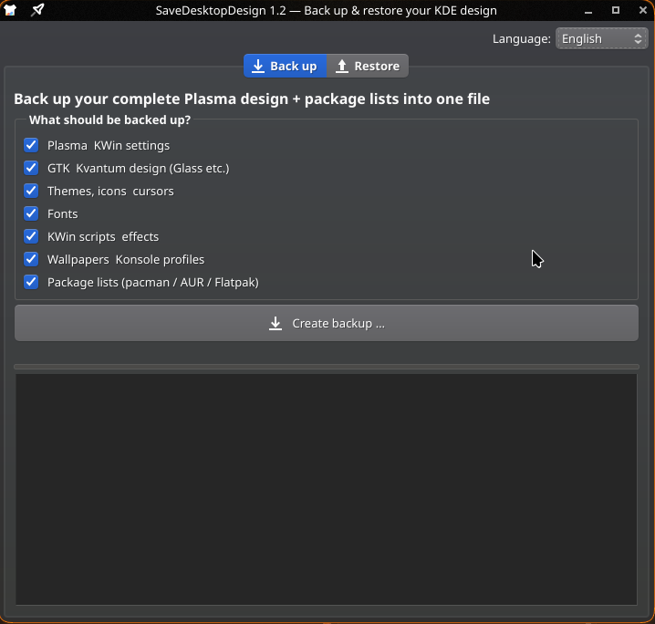

# SaveDesktopDesign

**Current version: 1.3.3** · [Changelog](#changelog)

Backs up your **entire KDE Plasma design from A to Z into a single file** — and restores it on a new machine with one click.

Works on **Arch-based systems (CachyOS, EndeavourOS …), Ubuntu/Debian and Fedora** — anywhere KDE Plasma runs.

🌍 **Languages:** English · Deutsch · Français · Italiano · Español · Português · Türkçe — auto-detects your system language, switchable in the app.



## What gets backed up?

| Category | Contents |
|---|---|
| Plasma & KWin | Global themes (incl. `kdedefaults`), panel layouts, shortcuts, window rules, Krohnkite/script settings, session autostart |
| GTK & Kvantum | Glass/Kvantum themes, GTK 2/3/4 configuration |
| Themes & icons | Desktop themes, look-and-feel, window decorations (Aurorae), color schemes, icons, cursors |
| Fonts | Custom fonts incl. fontconfig |
| KWin scripts & effects | Krohnkite & co. from `~/.local/share/kwin` |
| Wallpapers & more | Wallpapers, Konsole profiles |
| Package lists | pacman (explicit) & AUR, enabled repositories, apt (manual), dnf (user-installed), Flatpak — e.g. for Rounded Corners, Force Blur, Kvantum |

> **Note:** Compiled KWin plugins (e.g. Rounded Corners) live in system directories and are reinstalled via the **package list**, not copied as files.
> Package restore works between machines of the **same distro family** (Arch→Arch, Ubuntu→Ubuntu, Fedora→Fedora); the design files themselves restore on any distro.

> **What is *not* included:** anything outside your home directory — `/etc` (including your enabled repositories), SDDM and GRUB themes, systemd services.
> On Arch, packages from extra repositories (`chaotic-aur`, `cachyos-*` …) appear as ordinary native packages in the list and are silently skipped if that repository is missing on the target machine. The backup therefore also stores `pacman-repos.txt`, and the generated install script compares both repository lists before it starts.

## Installation

**Arch / CachyOS / EndeavourOS:**
```bash
sudo pacman -S --needed git python python-pyqt6
```

**Ubuntu / Debian:**
```bash
sudo apt install git python3 python3-pyqt6
```

**Fedora:**
```bash
sudo dnf install git python3 python3-pyqt6
```

Then:
```bash
git clone https://github.com/redsoul1905/Savedesktopdesign.git
cd Savedesktopdesign
./install.sh
```

You'll then find **SaveDesktopDesign** in your application menu.

Run directly without installing:

```bash
python3 savedesktopdesign.py
```

## Usage

**Back up (old machine):**
1. Launch the app → **Back up** tab
2. Select categories (default: everything) → **Create backup**
3. Copy the resulting `.tar.gz` to a USB drive / cloud storage

**Restore (new machine):**
1. Launch the app → **Restore** tab → choose the archive
2. Click **Install packages** (opens a terminal; automatically uses `pacman`/`paru`/`yay`, `apt`, `dnf` or `flatpak` depending on your system)
3. **Log out and back in** so KWin effects and the design fully apply

## Update

One command — pulls the latest version and reinstalls:

```bash
./install.sh --update
```

> Installed an older version (before v1.2.1)? Run this once inside your cloned folder, afterwards `--update` is available:
> ```bash
> git pull && ./install.sh
> ```

Or do a completely fresh install (deletes the old folder first):

```bash
rm -rf ~/Savedesktopdesign && git clone https://github.com/redsoul1905/Savedesktopdesign.git ~/Savedesktopdesign && cd ~/Savedesktopdesign && ./install.sh
```

## Uninstall

```bash
./install.sh --uninstall
```

## Requirements

- Linux with KDE Plasma — Arch-based (CachyOS, EndeavourOS …), Ubuntu/Debian or Fedora
- Python 3.10+ and PyQt6 (`python-pyqt6` on Arch, `python3-pyqt6` on Ubuntu/Fedora)
- Optional: `paru`/`yay` for AUR packages, `flatpak`

## Changelog

### v1.3.3
Bug-fix release — every issue below was reproduced before it was fixed.

- **Fixed a crash:** backup and restore shared a single worker reference, so starting a restore while a backup was still running dropped the running `QThread` and aborted the app (`QThread: Destroyed while thread is still running`). Both now have their own reference; buttons and the language selector are locked for the duration of a job, and the window refuses to close while a thread is alive.
- **Fixed a false failure report:** if `fc-cache` was missing, restore raised `FileNotFoundError` *after* all files had already been copied back and reported "restore failed". Post-processing (font cache, KWin reconfigure, `kbuildsycoca`) now runs step by step and no longer invalidates a successful restore.
- **Fixed package-only backups:** an archive created with no category selected contains no `home/` folder and could not be restored at all — the package lists inside were ignored.
- **Fixed the language selector** resetting the log and progress bar of a running job.
- **More settings backed up:** `kdedefaults` (the global theme defaults — without it a restored global theme only applied halfway), `plasma-localerc`, `kactivitymanagerdrc`, `systemsettingsrc`, `plasma-workspace`.
- **Repository awareness:** backups now include `pacman-repos.txt`; the generated install script shows which repositories the old machine had before packages get skipped.
- Completed the French, Italian, Spanish, Portuguese and Turkish translations (7 keys were falling back to English).
- `install.sh --update` now reports local changes instead of exiting silently through `set -e`.
- Terminal commands and paths are quoted (`shlex`), so a home directory containing spaces no longer breaks package installation.
- Removed a hardcoded local path from `savedesktopdesign.desktop`.

### v1.3
- Automatically installs `paru` if no AUR helper is present.
- Backs up window decoration configs (Klassy, Lightly, SierraBreezeEnhanced).

### v1.2.2
- Reloads the KWin configuration after a restore so Krohnkite gaps and effects apply immediately.
- Added `./install.sh --update`.

### v1.2
- Ubuntu/Debian (apt) and Fedora (dnf) support.
- Restore replaces existing files and symlinks instead of failing with `Errno 17`.

### v1.1
- Seven languages (DE/EN/FR/IT/ES/PT/TR) with auto-detection and a language selector.

### v1.0
- Initial release.

## License

MIT — see [LICENSE](LICENSE).
